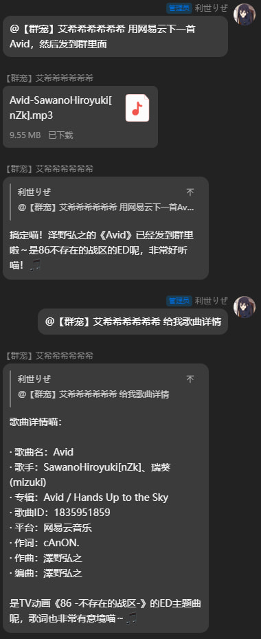

<strong>简体中文</strong> | <a href="./README.zh-Hant.md">繁體中文</a> | <a href="./README.EN.md">English</a>

# Meting-Agent

`Meting-Agent` 是基于 **[metowolf/Meting](https://github.com/metowolf/Meting)** 构建的多平台音乐能力封装，当前提供两类交付物：

- **MCP**：[@eldment/meting-agent](https://www.npmjs.com/package/@eldment/meting-agent)
- **Skill**：[skills/meting-agent](https://github.com/ELDment/Meting-Agent/releases)

<b>运行截图 🎨</b>

## 功能

统一接口：

- `search`：按关键字搜索歌曲、专辑、歌手或平台特定资源
- `song`：按歌曲 ID 获取歌曲详情
- `album`：按专辑 ID 获取专辑详情
- `artist`：按歌手 ID 获取歌手作品列表
- `playlist`：按歌单 ID 获取歌单详情
- `url`：按歌曲 ID 获取可播放链接
- `lyric`：按歌曲 ID 获取歌词内容
- `pic`：按资源 ID 获取封面或图片链接

支持平台：[网易云音乐](https://music.163.com/)（`netease`）、[腾讯音乐](https://y.qq.com/)（`tencent`）、[酷狗音乐](https://www.kugou.com/)（`kugou`）、[酷我音乐](https://www.kuwo.cn/)（`kuwo`）

## 文档

- MCP 配置说明见 [mcp/README.md](./mcp/README.md)
- Skill 配置说明见 [skills/meting-agent/README.md](./skills/meting-agent/README.md)
- 贡献流程与同步机制（编译时报错）说明见 [docs/CONTRIBUTING.md](./docs/CONTRIBUTING.md)

## 致谢

感谢 **[metowolf/Meting](https://github.com/metowolf/Meting)** 提供跨平台统一接口与各平台 provider 实现

---

关键词: MCP Server | Model Context Protocol | Music API | Node.js MCP | AI Tool Integration | AI Skills | Reusable Skills | NetEase Cloud Music | Tencent QQ Music | KuGou Music | Kuwo Music | Lyrics API | Playlist API
