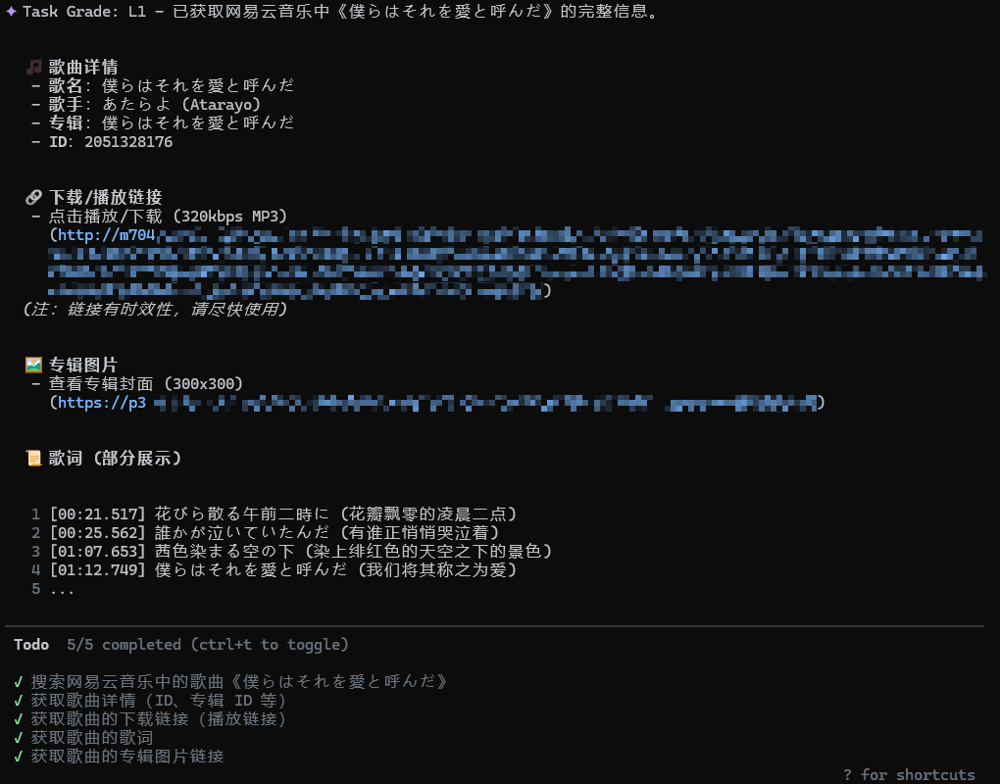

# Meting-Agent

`Meting-Agent` 是基于 **[metowolf/Meting](https://github.com/metowolf/Meting)** 构建的 MCP 服务，支持 [网易云音乐](https://music.163.com/)（`netease`）、[腾讯音乐](https://y.qq.com/)（`tencent`）、[酷狗音乐](https://www.kugou.com/)（`kugou`）、[千千音乐](https://music.taihe.com/)（`baidu`）、[酷我音乐](https://www.kuwo.cn/)（`kuwo`） 等音乐平台，提供搜索、歌曲、专辑、歌手、歌单、播放链接、歌词、封面等能力

<details>
<summary><b>运行截图</b></summary>


</details>

## 获取

通过 npm 发布，项目详情: [@eldment/meting-agent](https://www.npmjs.com/package/@eldment/meting-agent)

## MCP 工具

- `platforms`：列出支持的平台和平台代号
- `search`：按关键字搜索歌曲、专辑、歌手或平台特定资源
- `song`：按歌曲 ID 获取详情
- `album`：按专辑 ID 获取详情
- `artist`：按歌手 ID 获取作品
- `playlist`：按歌单 ID 获取详情
- `url`：按歌曲 ID 获取播放地址
- `lyric`：按歌曲 ID 获取歌词
- `pic`：按资源 ID 获取封面地址

## MCP 接入

Claude 配置示例：

```json
{
  "mcpServers": {
    "meting": {
      "command": "npx",
      "args": [
        "-y",
        "@eldment/meting-agent@latest"
      ],
      "env": {
        "METING_NETEASE_COOKIE": "__csrf=...; MUSIC_U=...; NMTID=...; __remember_me=true;",
        "METING_TENCENT_COOKIE": "uin=...; qm_keyst=...; qqmusic_key=...;",
        "METING_KUGOU_COOKIE": "KugooID=...; t=...; dfid=...; mid=...;",
        "METING_BAIDU_COOKIE": "...",
        "METING_KUWO_COOKIE": "..."
      },
      "timeout": 60000
    }
  }
}
```

Codex 配置示例：

```toml
[mcp_servers.meting]
type = "stdio"
command = "npx"
args = [
    "-y",
    "@eldment/meting-agent@latest",
]
env = {
    METING_NETEASE_COOKIE = "__csrf=...; MUSIC_U=...; NMTID=...; __remember_me=true;",
    METING_TENCENT_COOKIE = "uin=...; qm_keyst=...; qqmusic_key=...;",
    METING_KUGOU_COOKIE = "KugooID=...; t=...; dfid=...; mid=...;",
    METING_BAIDU_COOKIE = "...",
    METING_KUWO_COOKIE = "...",
}
tool_timeout_sec = 60
```

## Cookie 规则

运行时按以下优先级取 Cookie：

1. `METING_<PLATFORM>_COOKIE`
2. `METING_COOKIE`
3. MCP 工具参数中的 `cookie`

支持的环境变量：

- `METING_NETEASE_COOKIE`
- `METING_TENCENT_COOKIE`
- `METING_KUGOU_COOKIE`
- `METING_BAIDU_COOKIE`
- `METING_KUWO_COOKIE`
- `METING_COOKIE`（通用）

如果只需要给某一个平台带 cookie，优先使用对应的平台变量；如果想统一兜底，可以只设置 `METING_COOKIE`
